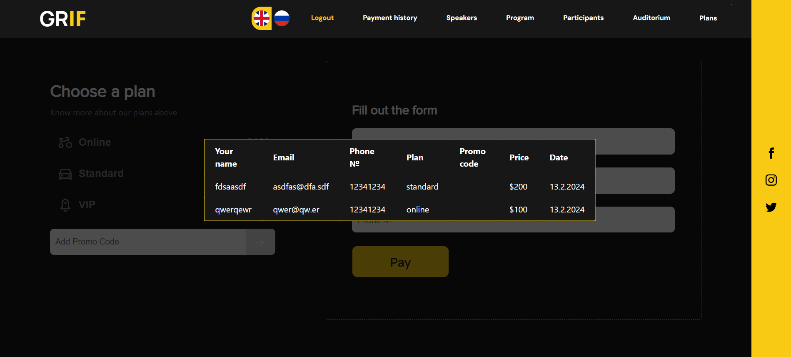

# GRIF

## Overview

The application represents fictional Global Realty Investing Forum.
The main goal of the application is to provide
a platform for investors to share their ideas and discuss the latest trends in the investment world.
The application is designed to be user-friendly and intuitive.
Also, the application is designed to be responsive and mobile-friendly.

## Features
Users can:
- Select language
- Discover what the forum is about
- Register and login
- Apply promo codes
- Buy tickets

Admins can:
- Create, update and delete promo codes

UI samples:

