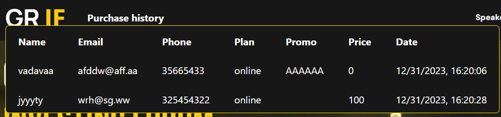

# GRIF

## Overview

This version of the project is developed to fulfill the requirements of the __tin__ __front+back__ assignment.
The project will evolve in complete web application to correspond final specifications - __tin__ __project__.

## Navigation

Below you can find requirements for the current version of the project and references to the implementations. 

## Table of Contents

- [a)](#A)
- [b)](#B)

### A
>An application that uses a database (either a relational one, such as postgres, or a nonrelational one, such as MongoDB). The data has to be displayed in the form of a table or
something similar. Some modifying operations should be possible, such as upserting the data.
A minimum of two tables that are connected is required. (5 points).

The choice for the database is [MongoDB](https://www.mongodb.com/). The data is stored in the database in the following
collections:
* __users__ - contains information about users
    * __name__ - name of the user
    * __email__ - email of the user
    * __phone__ - phone number of the user
    * __plan__ - tariff plan of the user
    * __promo__ - promo code of the user(if any); the field is also foreign key to __promos__ collection, however, since
MongoDB is non-relational, the promo code is checked for existence in the database in [user-schema.js](schemas/user-schema.js)
* __pricing__ - contains prices and tariff names
    * __plan__ - name of the tariff
    * __price__ - price of the tariff
* __promos__ - contains information about promos
  * __promo__ - promo code
  * __discount__ - discount for the promo code

To run the app, you need to have MongoDB installed. The database is run on the default port 27017. 

Then, in [db.js](database/db.js) file, you need to specify the path and the name of the database you want to use.
Then you can run a bootstrap script which is located in [db_bootstrap.js](database/db_bootstrap.js).
Finally, you can run the app with `npm start` command.

An application has a new dropdown table, which is populated with data user inputs in the application form.
To insert data into the table, you need to fill the form and press the button.

Although the table does not fetch data from the database (bc there is no user validation), the data gathered from the form
is inserted into the database. [purchase-service.js](services/purchase-service.js) contains the logic for validating and
inserting data into the database.

### B

> An app that asynchronously queries the backend asking for new information and updating
the webiste accordingly (without reloading the entire page). The data has to be generated on
the backend either randomly, read from file or otherwise changed over time. (5 points).

Here, I decided to edit [timer](public/js/timer.js) that is already present in the application.
The timer fetches deadline from the backend and updates the timer accordingly. Every 10000ms the timer
sends a request to the backend to get the new deadline. The deadline is stored in the [deadline.json](deadline.json).

To check its correctness, you can change the deadline in the file and see how the timer changes (remind you about 10 secs delay).

