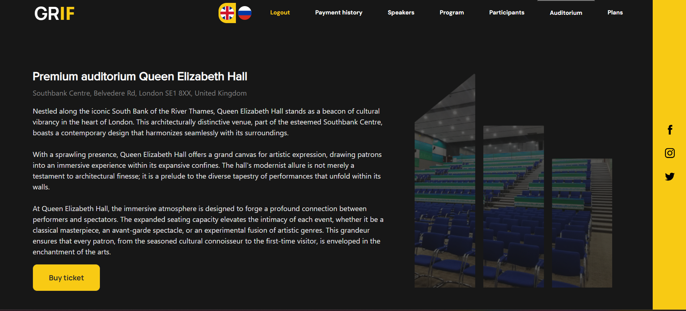
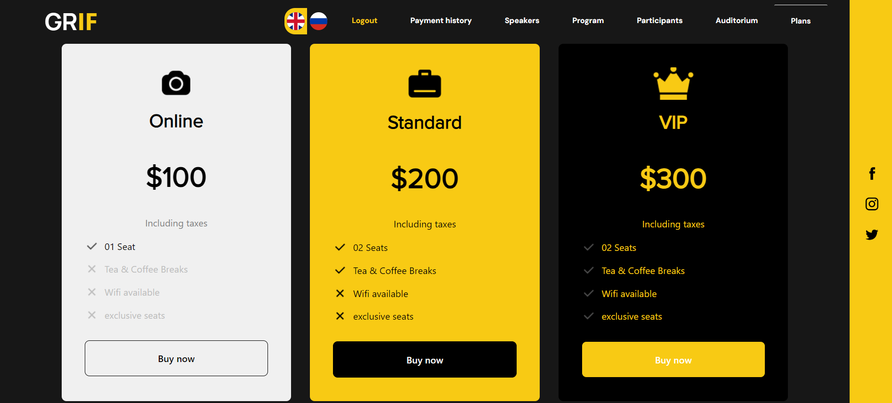

# GRIF

## Overview

This version of the project is developed to fulfill the requirements of the __tin project Version 1__ assignment.
The project will gain more features with updates.

## Navigation

Below, you can find requirements for the current version of the project and references to the implementations. 

## Table of Contents

- [5 points](#5)
- [10 points](#10)
- [15 points](#15)
- [Run](#run)
---
## 5
>- [x] At least 3 connected tables, and at least one many-to-many connection; the junction table should
   include at least one non-trivial column

At the current stage, data is stored in the following
collections:
* __user__ - contains information about users
    * __\_id__ - unique id
    * __username__ - unique name
    * __password__ - password for an account
    * __role__ - role(customer, admin)
* __pricing__ - contains prices and plan names
    * __\_id__ - unique id
    * __name__ - name
    * __price__ - price
* __promos__ - contains information about promos
  * __\_id__ - unique id
  * __name__ - promo code
  * __discount__ - discount associated with a promo code
  * __used__ - boolean value that indicates whether the promo code is used or not (not exploited yet)
* __purchases__ - association table between users, pricing and promos
  * __\_id__ - unique id
  * __userId__ - id of the associated user
  * __planId__ - id of the associated plan (Pricing)
  * __promoId__ - id of the associated promo (Promos)
  * __name__ - name of the payer (not the username)
  * __email__ - email of the payer
  * __phone__ - phone number of the payer
  * __date__ - date of the purchase
  
From above, it is clear that there is a many-to-many relationship between users, promos and pricing.
The __purchases__ table is a junction table that connects all three tables and contains non-trivial columns:
*name*, *email*, *phone*, *date*.

>- [x] At least 3 different types of columns.

Different types of columns presented:
* __\_id__ - ObjectId
* __name__ - String
* __price__ - Number
* __date__ - Date
* __used__ - Boolean (Even though it is not used yet)

>- [x] At least 2 columns in each of the tables.

Each table has at least 3 columns.

**Database structure** is implemented in [db_bootstrap.js](database/db_bootstrap.js) file.

### Functionalities:

>- [x] Full CRUD for the data

Using the provided API, you can perform CRUD operations on specified collections.
For example, a **Promos** collection has the following [endpoints](routers/promo.js):
* GET /promo/page - _**read**_ all promos within specified page in body
* PUT /promo - _**create**_/_**update**_ promo with specified data in body
* DELETE /promo - _**delete**_ promo with specified name in body

Some collections do not have all CRUD operations implemented because of its redundancy.

>- [x] Displaying some projection of the stored data

For this purpose, a history of purchases is displayed for each customer.

All the columns are displayed except for the **\_id** column.
Also, all connected records are displayed as proper names instead of their ids.

>- [x] Displaying the detailed data for the tables

For this specification, the already mentioned Promo management page is used.

Finally
>- [x] Both client-side and server-side validation of forms.

Here, partial client-side validation is implemented for the Promo management page
(if the value is out of the 100 % range, it is converted into 0 or 100).
The validation relies more on the server-side as the application supports internationalization
and the validation messages are sent translated to the client. 
The usage of AJAX requests for that purpose would be highly inefficient.

For that case, let's consider the application form:

*It is worth mentioning that despite given example, all the forms are validated using the same approach.*

The form is validated on the server-side in [purchase-service.js](services/purchase-service.js).

All the fields are checked as well as user's role and promo code. If something is wrong, the error is thrown.
The error is passed to the [error handler](app.js), converted into html message and sent to a client.

The solution has to contain:
- Database [creation and seeding script](database/db_bootstrap.js)

---
## 10
### Additional functionality:

>- [x] Registration and logging in – that includes the necessary database tables

Tables for users are already presented in the [5 points](#5) section.

The registration and logging in are implemented in [user.js](routers/user.js) file.

The validation is performed on the server-side as discussed in the [5 points](#5) section.

>- [x] Different roles for users – for example only certain users can modify data (admins), some can only
  view it, some can just be stuck on an unauthorised access website (unregistered users); in here it is
  enough to just make a distinction between logged in (full access) vs unlogged in user (no access)

This point is discussed [here](#15).

>- [x] List pagination

List pagination is implemented for the Promo management page.

- front script: [promo-table.js](public/js/promo-table.js)
- back script: [promo-service.js](services/promo-service.js)
---
## 15
### Additional functionality:

>- [x] The frontend has to be realised as Single Page Application (SPA)

The frontend is implemented as a Single Page Application in [index.pug](views/index.pug) file.
All styles and scripts are included in the public folder.

>- [x] At least 3 roles for users (such as admin, user, guest) – each of them with separate access levels

There are 3 roles presented in the application:
- __guest__ - can view the page
- __customer__ - guest that can make purchases
- __admin__ - guest that has an ability to modify promos

__guest__ is not specified in the database as it is not necessary.

Access is checked in according services to endpoints.

>- [x] Access introduced on a resource level – for instance, a user only has access to their own orders, not
   to the orders of everybody in the system

For example, user is stored in session, and when the user tries to access his orders,
the user is retrieved from the session and the orders are filtered by the user id.

>- [x] - Internationalisation (at least 2 languages)

In the application, two languages are supported: English and Russian.
It can be toggled at the top of the page.

Once the language is changed, the language cookie is set and the page is reloaded.

Two frameworks are used for internationalization:
- [i18n-express](https://www.npmjs.com/package/i18n-express) - for the client-side
- [i18n](https://www.npmjs.com/package/i18n) - for notification messages
---
## Run
To run the application, you need to install all the dependencies with `npm install` command.

Configure your local MongoDB database.

Then, in [db.js](database/db.js) file, you need to specify the path and the name of the database you want to use.

The next step is to run a bootstrap script which is located in [db_bootstrap.js](database/db_bootstrap.js).

Finally, you can run the app with `npm start` command.
